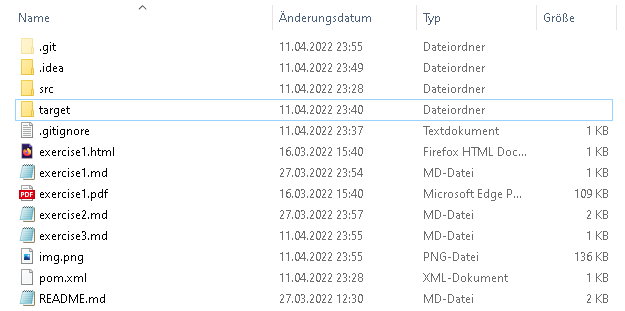
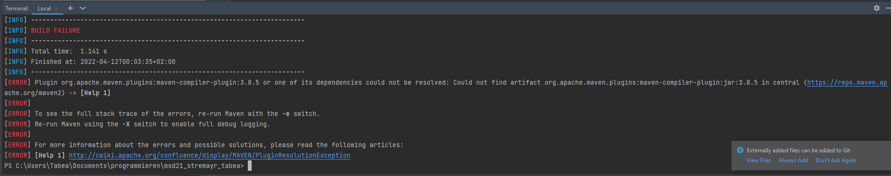
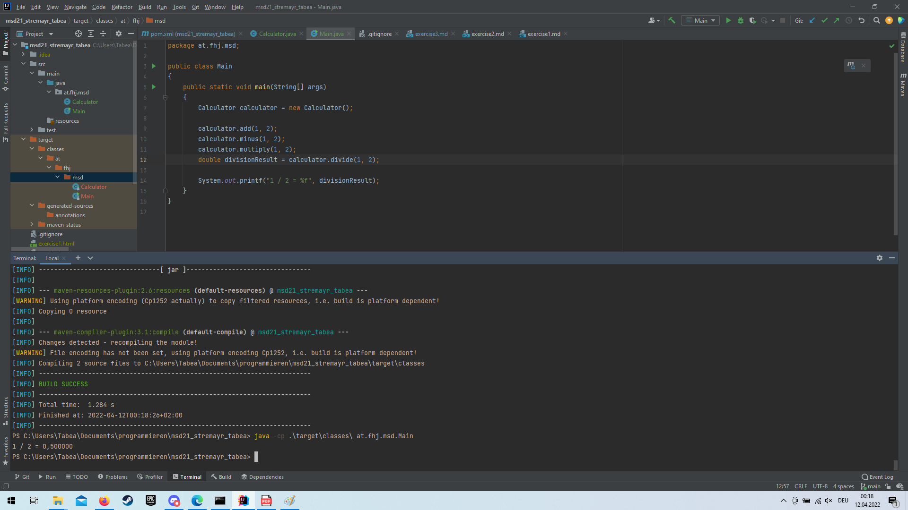

# New Folder after first execution

After the first execution of the main method,
the folder ```target``` was created in the git root directory.
In the target folder are the compiled java classes (.class files) and other generated files.


# mvn compile

After copying the xml tags from the exercise sheet to the ```pom.xml```,
the
```mvn compile``` command failed with the following error message:


After fixing the ```<groupId>``` and ```<artifactId>``` xml tags, ```mvn compile``` is successful.
Then the execution of the Main.class also works with the following command:
```
java -cp .\target\classes\ at.fhj.msd.Main
```
